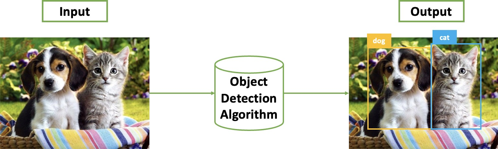
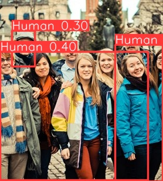

# Human Detection
## Giới thiệu

Phát hiện đối tượng (Object Detection) là một bài toán thuộc lĩnh vực Thị giác máy tính (Computer Vision), trong đó nhiệm vụ của chúng ta là xây dựng một chương trình có thể trả về các tọa độ (bounding box) và tên phân lớp (class name) của những vật thể có trong ảnh mà ta mong muốn tìm kiếm (detection).



**Hình 1.** Input/Output của bài toán Object Detection với vật thể cần xác định là Chó, Mèo.

 

**Hình 2.** Ví dụ minh họa kết quả của chương trình Human Detection sử dụng YOLOv8.

Trong project này, chúng ta sẽ tìm hiểu và thực hành cài đặt mã nguồn chương trình Python về Phát hiện con người (Human Detection) có trong một tấm ảnh, video,... sử dụng thuật toán có tên gọi là YOLOv8.

## Cài đặt chương trình

Để cài đặt và sử dụng thuật toán YOLOv8, các bạn hãy thực hiện theo các bước hướng dẫn sau:

### Chuẩn bị môi trường cài đặt

Để thuận tiện trong việc sử dụng YOLOv8, chúng ta sẽ dùng Google Colab làm môi trường cài đặt. Các bước sử dụng Google Colab được thực hiện như sau:

- **Bước 1:** Truy cập vào đường dẫn sau: [link](https://colab.research.google.com/?utm_source=scs-index). Nếu truy cập thành công, các bạn sẽ thấy giao diện như hình dưới đây:

    

    **Hình 3.** Giao diện chính của Google Colab

    Sau đó, các bạn hãy đăng nhập bằng tài khoản Google của mình. Nếu đăng nhập thành công, một cửa sổ mới sẽ hiện lên như hình dưới đây:

    

    **Hình 4.** Giao diện Google Colab sau khi đăng nhập thành công

- **Bước 2:** Khởi tạo notebook mới. Notebook sẽ là giao diện để ta có thể viết các dòng lệnh Python. Để tạo được notebook, các bạn thực hiện thao tác theo hình dưới đây:

    

    **Hình 5.** Khởi tạo notebook mới

- **Bước 3:** Thay đổi runtime của notebook từ CPU thành GPU.

    

    **Hình 6.** Các bước kích hoạt GPU cho notebook mới trên Google Colab

- **Bước 4:** Cuối cùng, để có thể thực thi các dòng lệnh Python, ta cần khởi động notebook. Các thao tác khởi động một notebook trong Google Colab sẽ như hình sau:

    

    **Hình 7.** Khởi động một notebook có GPU trong Google Colab

Sau khi thực hiện các bước trên, các bạn đã có một môi trường code Python với GPU miễn phí từ Google.

### Tải mã nguồn YOLOv8 từ GitHub

Để sử dụng YOLOv8, chúng ta cần tải mã nguồn (source code) của YOLOv8 về môi trường cài đặt code, mã nguồn của YOLOv8 được công khai trên GitHub. Như vậy, các bạn sẽ thực hiện theo các bước sau:

- **Bước 1:** Các bạn truy cập vào đường dẫn GitHub của YOLOv8 tại [đây](https://github.com/ultralytics/ultralytics). Nếu truy cập thành công, các bạn sẽ thấy giao diện như hình dưới:

    

    **Hình 8.** Giao diện GitHub của YOLOv8

- **Bước 2:** Tại trang GitHub của YOLOv8, các bạn chọn mục Code (có màu nền xanh dương như ảnh dưới) và chọn nút copy đường dẫn như ảnh minh họa dưới đây:

    

    **Hình 9.** Copy đường dẫn để tải mã nguồn YOLOv8

- **Bước 3:** Quay lại Google Colab, các bạn khởi tạo một code cell sử dụng lệnh: !git clone link (trong đó **link** là đường dẫn GitHub đã copy ở **bước 2**). Nếu code cell thực thi thành công, ta kết quả sẽ hiển thị như hình sau:

    

    **Hình 10.** Tải mã nguồn YOLOv8 sử dụng lệnh git clone

    Để kiểm tra, các bạn có thể refresh lại phần **Files** của Google Colab để xem thư mục YOLOv8 đã xuất hiện hay chưa.

    

    **Hình 11.** Thư mục YOLOv8

### Cài đặt các gói thư viện Python  cần  thiết  theo  yêu  cầu  của  YOLOv8

Mã  nguồn YOLOv8 được xây dựng bằng rất nhiều các thư viện Python khác nhau. Vì vậy, để có thể chạy được YOLOv8 ta cần tải các gói thư viện cần thiết mà YOLOv8 yêu cầu. YOLOv8 có hỗ trợ sẵn thư viện tên **ultralytics**, chúng ta có thể tải thư viện này thông qua lệnh pip như sau:


**Hình 12.** Tải thư viện ultralytics dùng lệnh pip

Ngoài cách trên, ta cũng có thể cài đặt các gói thư viện bằng cách sử dụng file setup có sẵn trong mã nguồn của YOLOv8, các bạn có thể làm như sau:


**Hình 13.** Tải các gói cài đặt cần thiết thông qua file setup

### Tải Pretrained Model

Các bạn tải file pretrained model tại [đây](https://github.com/ultralytics/assets/releases/download/v0.0.0/yolov8s.pt) và đặt file đã tải vào thư mục **./ultralytics.** Trên Google Colab, việc này có thể được thực hiện thông qua lệnh **wget** như hình dưới đây:


**Hình 14.** Tải pretrained model sử dụng lệnh wget

Để kiểm tra xem file pretrained model đã được tải về thành công hay chưa, các bạn refresh phần **Files** của Google Colab và tìm kiếm file có tên **YOLOv8s.pt**


**Hình 15.** File pretrained model

### Chuẩn bị dữ liệu

Để huấn luyện YOLOv8 trên một bộ dữ liệu bất kì, chúng ta cần hai thành phần chính như sau:

- **Thư mục chứa dữ liệu:** Các bạn cần chuẩn bị một thư mục chứa bộ dữ liệu (thư mục này nằm trong thư mục **YOLOv8**) có cấu trúc cây thư mục như sau:

    

    **Hình 16.** Tổ chức thư mục bộ dữ liệu trong YOLOv8

    **Trong đó:**

    - **Thư mục images:** Chứa các file ảnh (.jpg, .png...).
    - **Thư mục labels:** Chứa các file .txt tương ứng với từng ảnh (có cùng tên file trong thư mục images).
    - **File data.yaml:** Nội dung chi tiết ở phần sau.

    Bộ dữ liệu human các bạn tải tại [đây](https://drive.usercontent.google.com/download?id=1--0QuKMwj31K-CSvD8oq5fceFweiFPuN&export=download&authuser=0). Các bạn có thể tải thủ công file .zip này về hoặc sử dụng các dòng lệnh sau để tải và giải nén file tự động:

    ```
    !gdown https://drive.google.com/u/0/uc?id=1--0QuKMwj31K- CSvD8oq5fceFweiFPuN&export=download

    !unzip /content/human_detection_dataset.zip
    ```

    Nếu không được thì tải thủ công sau đó cho file human_detection_dataset.zip vào google drive của bạn và thực hiện các lệnh sau:

    ```
    from google.colab import drive

    drive.mount('/content/gdrive')

    !cp /content/gdrive/MyDrive/human_detection_dataset.zip .

    !unzip /content/ultralytics/human_detection_dataset.zip
    ```

- **File .yaml:** Các bạn cần chuẩn bị một file .yaml chứa các thông tin về bộ dữ liệu phía trên trong thư mục **data**, ta có thể coi một số file .yaml mẫu được tác giả YOLOv8 cung cấp sẵn:


**Hình 17.** Các trường thông tin quan trọng trong file .yaml

Như vậy, đối với bộ dữ liệu **human**, ta chỉ việc tạo một file .yaml mới (ví dụ data.yaml) và điền các trường thông tin tương ứng (thư mục dữ liệu đã cung cấp sẵn file này cho các bạn). Ở đây các bạn có thể thực hiện thủ công hoặc sử dụng các dòng lệnh bên dưới đây để tạo tự động. Lưu ý rằng file .yaml cần được đặt ở trong thư mục của bộ dữ liệu **human_detection_dataset**:

```
import yaml

dataset_info = {
    'train': './train/images'
    'val': './val/images'
    'path': '/content/ultralytics/human_detection_dataset'
    'nc': 1
    'names': ['Human']
}

with open (’./ human_detection_dataset/data.yaml’, ’w+’) as f:
    doc = yaml.dump(dataset_info, f, default_flow_style=None, sort_keys = False)
```

Mỗi bộ dữ liệu khác nhau sẽ có nội dung thông tin khác nhau, vì vậy các bạn cần sẽ có những điều chỉnh cho phù hợp với bộ dữ liệu mà mình sử dụng (số lượng class, tên các class, đường dẫn đến thư mục dữ liệu...).

### Thực hiện huấn luyện

Sau khi đã hoàn tất các bước chuẩn bị trên, chúng ta sẽ thực hiện huấn luyện (training) với bộ dữ liệu đã chuẩn bị, các bạn hãy thực thi dòng lệnh dưới đây (đối với dữ liệu khác các bạn cần thay đổi tên file .yaml tương ứng):

```
!yolo train model = yolov8s.pt data =./human_detection_dataset/data.yaml epochs=20 imgsz=640
```

Sau khi kết thúc quá trình training, các bạn sẽ thấy nội dung in màn hình có dạng như hình minh họa dưới đây:


**Hình 18.** Nội dung in màn hình sau khi kết thúc quá trình training

Kiểm tra thư mục **./runs**, các bạn sẽ thấy một file **./detect/train** xuất hiện, đây chính là file output của YOLOv8.


**Hình 19.** Thư mục train

### Thực hiện Detection (Prediction) với mô hình đã huấn luyện

Để sử dụng mô hình đã huấn luyện lên một tấm ảnh bất kì, các bạn hãy sử dụng câu lệnh bên dưới:

```
# With uploaded image
!yolo predict model=<weight_path> source=<image_path>
```

**Trong đó:**

- **<weight_path>:** Đường dẫn đến file weight của mô hình sau khi kết thúc quá trình huấn luyện. Các bạn có thể tìm thấy trong đoạn in kết thúc quá trình huấn luyện của YOLOv8.


**Hình 20.** Đường dẫn đến file weight của mô hình đã huấn luyện. **Lưu ý:** Các bạn cần chọn file **best.pt**

- **<image_path>:** Đường dẫn đến file hình ảnh input.

Dưới đây là ảnh kết quả minh họa sau khi thực thi đoạn code trên:


**Hình 21.** Đường dẫn đến file output.

Bên cạnh source về ảnh, các bạn cũng có thể input source với các tham số khác nhau, đại diện cho các dữ liệu đầu vòa khác nhau:


**Hình 21.** Tổng hợp các kiểu dữ liệu đầu vào YOLOv8 hỗ trợ trong việc thực hiện predict

Bước này cũng là bước cuối cùng trong chuỗi hướng dẫn sử dụng YOLOv8.


